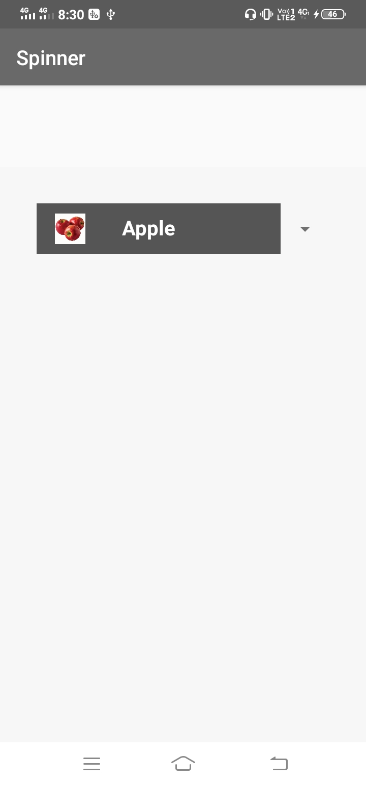
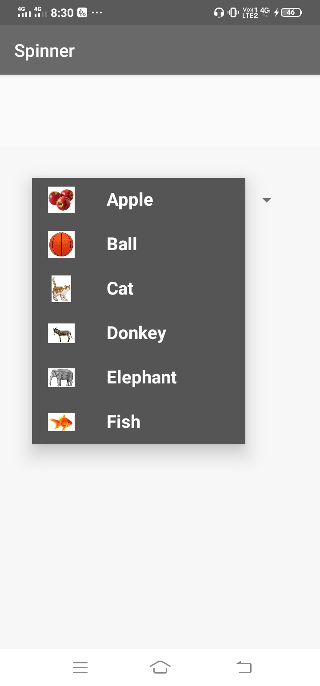
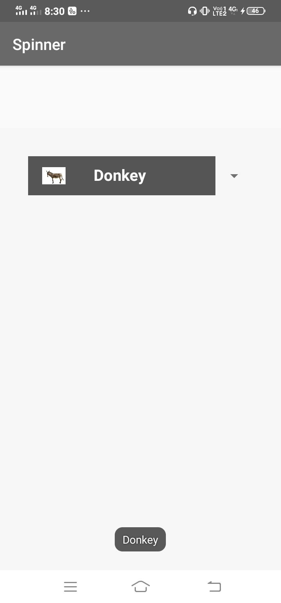
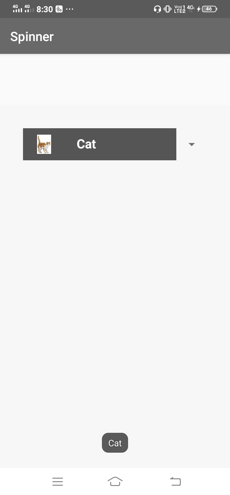

# Custom_spinner_with_images_and_text

In this tutorial we have created a simple custom spinner with images and text.

A Toast message with item name is used when clicked on a item.

## Demo

      

